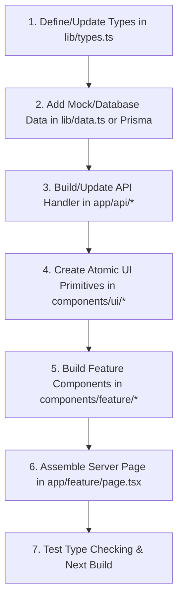

# PROJECT_STATE.md — KingHouse Hospitality Web Platform

> **Single Source of Truth (SSOT)** for AI Coding Agents (Claude 4.6 Sonnet, GPT, Antigravity, etc.).  
> Read this document to understand architectural standards, technical stack, current implementation status, data schemas, and development workflows without rescanning the entire repository.

---

## 1. EXECUTIVE SUMMARY & TECH STACK

### 1.1 Core Purpose & Scope
**KingHouse** is an editorial-grade, ultra-luxury villa management & dual-path booking platform based in Bali (Seminyak, Canggu, Uluwatu, Ubud, Sanur, Pererenan). It caters to two primary user personas:
1. **Discerning Guests**: Seeking high-end curated villa stays with rich architectural bento photo galleries, split pricing (USD/IDR), amenity breakdowns, proximity maps, and direct booking inquiry workflows.
2. **Villa Owners & Investors**: Exploring hospitality property management, transparent tier breakdowns (Essential vs Complete Management), ROI/performance metrics, free property audit requests, and WhatsApp onboarding.

### 1.2 Tech Stack Table

| Category | Technology | Version / Configuration | Purpose |
| :--- | :--- | :--- | :--- |
| **Framework** | Next.js (App Router) | `16.0.7` (`next dev --turbopack`) | Core fullstack framework & routing |
| **Runtime / Core** | React / React DOM | `19.2.0` | Modern React UI with Server/Client Components |
| **Language** | TypeScript | `^5.0` (Strict mode in `tsconfig.json`) | Type safety across schemas, state, and props |
| **Styling** | Tailwind CSS v4 + PostCSS | `@tailwindcss/postcss ^4`, `tailwindcss ^4` | Modern CSS-in-JS utility engine (`@theme inline`) |
| **UI Primitives** | Radix UI Slot (`@radix-ui/react-slot`), CVA | `class-variance-authority ^0.7.1`, `clsx`, `tailwind-merge` | Headless, accessible polymorphic components |
| **Animations** | Framer Motion | `^12.23.25` | Fluid micro-interactions, modal reveals, accordion triggers |
| **Icons** | Lucide React | `^0.556.0` | Streamlined vector iconography |
| **Internationalization** | `next-intl` | `^4.5.8` | Multilingual support ready (EN/ID) |
| **Font Management** | `next/font/google` | Plus Jakarta Sans (Body), Playfair Display (Serif Editorial) | Editorial typography with CSS variable binding |
| **Data Layer** | In-Memory Static Store (`lib/data.ts`) | Ready for Prisma + PostgreSQL or MongoDB migration | Mock dataset with production-ready TypeScript schemas |

---

## 2. PROJECT STRUCTURE & ARCHITECTURE

### 2.1 Essential Directory Tree

```
kinghouse-mockup/
├── app/                              # Next.js App Router root
│   ├── about/page.tsx                # Brand heritage, mission, leadership, ethos
│   ├── contact/page.tsx              # Multichannel inquiry & direct WhatsApp/Email
│   ├── locations/                    # [Route Stub] Area-specific landing pages
│   ├── owner-services/page.tsx       # Property management tiers, audit form, ROI metrics
│   ├── services/page.tsx             # Concierge & VIP guest service offerings
│   ├── villas/                       # Villa directory & dynamic detail routes
│   │   ├── [slug]/page.tsx           # Dynamic single villa editorial page with Bento gallery
│   │   └── page.tsx                  # Filterable villa catalog (area, bedrooms, price, style)
│   ├── globals.css                   # Tailwind v4 theme, CSS variables, custom scrollbars
│   ├── layout.tsx                    # Root layout with Header, Footer, and Google Fonts
│   └── page.tsx                      # Dual-audience high-converting homepage
├── components/                       # Feature-first component architecture
│   ├── bento/                        # Luxury Bento-grid media components
│   │   ├── bento-gallery.tsx         # Asymmetrical 5-photo responsive grid
│   │   └── photo-lightbox-modal.tsx  # Fullscreen category-filtered modal lightbox
│   ├── home/                         # Homepage exclusive sections
│   │   ├── curated-grid.tsx          # Featured architectural collection cards
│   │   ├── dual-path-split.tsx       # Interactive Guest vs Owner pathway split
│   │   ├── hero-slider.tsx           # High-impact background slider with quick filter
│   │   ├── search-filter-bar.tsx     # Area, dates, guests, price inline search bar
│   │   └── trust-social-proof.tsx    # Superhost metrics, partner logos, guest reviews
│   ├── layout/                       # Global shell components
│   │   ├── footer.tsx                # Editorial multi-column footer & newsletter
│   │   └── header.tsx                # Sticky blur-backdrop navigation + mobile drawer
│   ├── owner/                        # Villa owner & management specific components
│   │   ├── lead-audit-form.tsx       # Multi-step property audit & ROI inquiry form
│   │   ├── onboarding-timeline.tsx   # 4-stage owner onboarding process
│   │   ├── performance-metrics.tsx   # Before/after case study metrics & EBITDA lift
│   │   ├── tiered-pricing-table.tsx  # Essential (15%) vs Complete (20%) breakdown
│   │   └── value-props-grid.tsx      # Pillars: Distribution, Interior, Revenue Mgmt
│   ├── ui/                           # Reusable design system primitives
│   │   ├── badge.tsx                 # Status badges & luxury pill indicators
│   │   ├── button.tsx                # CVA-powered buttons (default, outline, ghost, gold)
│   │   ├── card.tsx                  # Radix-inspired atomic card wrapper
│   │   └── input.tsx                 # Standardized input fields with focus rings
│   └── villas/                       # Villa catalog and detail components
│       ├── amenities-grid.tsx        # Categorized amenity icons & modal expansion
│       ├── booking-sidebar.tsx       # Sticky dynamic booking widget (USD/IDR, dates)
│       ├── location-proximity-map.tsx# Distance/travel time to beach, airport, dining
│       ├── schema-markup.tsx         # JSON-LD Structured Data for SEO / VacationRental
│       ├── search-bar.tsx            # Catalog page filter bar
│       └── villa-card.tsx            # Editorial villa card with badge, price & tags
├── lib/                              # Core business logic, data, and utilities
│   ├── constants.ts                  # Nav links, location metadata, amenities, management tiers
│   ├── data.ts                       # Rich mock datasets (Villas, Testimonials, Case Studies)
│   ├── types.ts                      # Universal TypeScript interfaces and domain models
│   └── utils.ts                      # `cn()` helper, currency formatters (USD/IDR), date utils
└── public/                           # Static assets, fallback imagery, and icons
```

### 2.2 Architectural Patterns
- **Server/Client Component Separation**:
  - `page.tsx` and static wrappers are **Server Components** by default for maximum SEO and fast initial HTML render.
  - Interactive widgets (`"use client"`) are isolated to leaf nodes (`photo-lightbox-modal.tsx`, `booking-sidebar.tsx`, `lead-audit-form.tsx`, `hero-slider.tsx`).
- **Feature-First Component Modularity**: Components are grouped by business domain (`/bento`, `/villas`, `/owner`, `/home`) instead of arbitrary flat UI lists.
- **Design System Tokens (`app/globals.css`)**:
  - Semantic CSS Variables: `--bg-main`, `--bg-secondary`, `--text-primary`, `--accent-color`, `--shadow-subtle`, etc.
  - Typography: Serif (`var(--font-serif)`) for editorial headings; Sans (`var(--font-sans)`) for UI/Body.
- **Zero-Dependency Styling Utilities**: Utilizes `cn()` (`clsx` + `tailwind-merge`) and `cva()` for type-safe component variant generation.

---

## 3. CURRENT IMPLEMENTATION STATE & DATA FLOW

### 3.1 Implemented Modules & Active Features

| Module | Route / Component | State / Capabilities |
| :--- | :--- | :--- |
| **Homepage** | `app/page.tsx` | Hero slider, quick-search filter, curated collections, dual-path selector, trust metrics, and social proof. |
| **Villa Catalog** | `app/villas/page.tsx` | Multi-parameter filtering (Location slug, price range, bedrooms, architectural style). |
| **Villa Detail** | `app/villas/[slug]/page.tsx` | Dynamic slug lookup, editorial story, 5-image Bento grid with modal lightbox, sticky booking sidebar, and JSON-LD schema. |
| **Owner Services** | `app/owner-services/page.tsx` | Management value propositions, 15% vs 20% tier comparison, case study metrics (revenue/occupancy lift), and interactive audit request form. |
| **Services** | `app/services/page.tsx` | In-villa chef, chauffeur, spa, yacht charter, and VIP concierge booking interfaces. |
| **About Us** | `app/about/page.tsx` | Brand philosophy, team profiles, sustainability commitment, and operational footprint. |
| **Contact** | `app/contact/page.tsx` | Interactive contact form, WhatsApp quick-links, Bali office coordinates, and direct email. |

### 3.2 Data Models & TypeScript Schema (`lib/types.ts`)

```typescript
// Core Domain Models
export interface Villa {
  id: string;
  name: string;
  tagline: string;
  slug: string;
  area: string;
  areaSlug: string;
  location: string;
  airbnbUrl: string;
  superhost: boolean;
  guestFavorite: boolean;
  rating: number;
  reviewsCount: number;
  price: {
    usd: number;
    idr: number;
    cleaningFeeUsd: number;
    serviceFeePercent: number;
  };
  capacity: {
    guests: number;
    bedrooms: number;
    beds: number;
    bathrooms: number;
  };
  heroImage: string;
  gallery: {
    url: string;
    caption: string;
    category: "exterior" | "living" | "bedroom" | "pool" | "bathroom" | "dining";
  }[];
  editorialDescription: {
    lead: string;
    architecturalHighlights: string;
    theSpace: string;
  };
  amenities: VillaAmenity[];
  nearbySpots: NearbySpot[];
  featured: boolean;
  architecturalStyle: string;
}

export interface ManagementTier {
  id: string;
  name: string;
  subtitle: string;
  feePercentage: number;
  feeNote: string;
  badge?: string;
  description: string;
  popular?: boolean;
  features: { title: string; included: boolean; highlight?: boolean }[];
  idealFor: string;
}

export interface CaseStudy {
  id: string;
  villaName: string;
  location: string;
  image: string;
  period: string;
  beforeMetrics: { occupancyRate: number; monthlyRevenueUsd: number; guestRating: number };
  afterMetrics: { occupancyRate: number; monthlyRevenueUsd: number; guestRating: number; ebitdaMargin: number };
  summary: string;
  quote: { text: string; author: string };
}
```

### 3.3 Data Flow Architecture
1. **Read Operations**: Server Components read synchronously from `lib/data.ts` using helper lookup methods (`villas.find(v => v.slug === slug)`).
2. **Client State**:
   - Filter bars sync state via React `useState` and propagate to cards.
   - Lightbox modal maintains active image index and category filter.
   - Sticky Booking widget dynamically calculates stay totals, cleaning fees, and currency conversion on client input.
3. **Form Actions**: Contact & Lead Audit forms validate client inputs and trigger WhatsApp direct links or stubbed API dispatchers.

---

## 4. REMAINING TASKS, TODOS & TECHNICAL DEBT

### 4.1 Backend & Database Persistence (Priority Roadmap)
- [ ] **Prisma / PostgreSQL or Supabase Integration**:
  - Replace static `lib/data.ts` with database schema (see `IMPLEMENTATION.md`).
  - Migrate models: `Villa`, `Booking`, `Review`, `User`, `LeadAudit`, `ServiceInquiry`.
- [ ] **Next.js Route Handlers (`app/api/*`)**:
  - `GET /api/villas` & `GET /api/villas/[slug]` (with server-side pagination & filter query params).
  - `POST /api/bookings` (reservation creation + availability check).
  - `POST /api/leads/audit` (owner villa audit submission & CRM webhook dispatch).
  - `POST /api/contact` (Resend/SendGrid transactional email dispatch).
- [ ] **Payment Gateway Integration**:
  - Stripe or Midtrans / Xendit (for Indonesian IDR Virtual Accounts, QRIS, Credit Cards).

### 4.2 Frontend Enhancements & Missing Routes
- [ ] **Location Landing Pages (`app/locations/[slug]/page.tsx`)**:
  - Implement location-specific landing pages (e.g., `/locations/canggu`, `/locations/uluwatu`) for local SEO.
- [ ] **Dynamic Live Calendar Availability**:
  - Connect iCal sync (Airbnb, Booking.com, VRBO) to `booking-sidebar.tsx` date picker.
- [ ] **Interactive Map View**:
  - Integrate Mapbox or Google Maps JS API for multi-villa map view on `app/villas/page.tsx`.

### 4.3 Technical Debt & Refactoring
- [ ] **Package Update**: `baseline-browser-mapping` needs updating (`npm i baseline-browser-mapping@latest -D`).
- [ ] **Lint & Typecheck Pipeline**: Add CI test command (`next lint && tsc --noEmit`).
- [ ] **Automated Testing**: Add Playwright / Cypress E2E tests for booking and lead audit flows.

---

## 5. AI AGENT CODING GUIDELINES

When writing code or implementing new features in this repository, AI agents **MUST** strictly adhere to the following standards:

### 5.1 Naming & File Placement Conventions
- **Components**: Kebab-case filenames (`components/villas/villa-card.tsx`), PascalCase exported functions (`export function VillaCard()`).
- **Route Pages**: Next.js App Router standard (`app/[feature]/page.tsx`, `app/[feature]/[slug]/page.tsx`).
- **Utilities & Helpers**: Placed in `lib/` in kebab-case (`lib/utils.ts`, `lib/currency-formatter.ts`).
- **Types**: Place domain models in `lib/types.ts`. Avoid inline interfaces for shared domain models.

### 5.2 Styling & Aesthetics Rules
- **Design System Consistency**: Use existing Tailwind CSS theme variables (`bg-main`, `bg-secondary`, `text-primary`, `accent-color`, `border-subtle`).
- **Typography Pairing**:
  - Headings & Editorial Titles: `font-serif` (`Playfair Display`).
  - Body, Metadata, & Form Elements: `font-sans` (`Plus Jakarta Sans`).
- **Luxury Look & Feel**: Always maintain generous macro-spacing (`section-macro-spacing` or `py-16 lg:py-24`), subtle borders (`border-subtle`), and smooth cubic-bezier transitions (`hover-editorial-zoom`).

### 5.3 Step-by-Step Feature Implementation Workflow



1. **Step 1 (Types)**: Define all interfaces, payloads, and response types in `lib/types.ts`.
2. **Step 2 (Data Layer)**: Add mock items in `lib/data.ts` or database queries with complete fallback data.
3. **Step 3 (API Route)**: Implement validation and Next.js route handlers in `app/api/` returning typed `NextResponse.json()`.
4. **Step 4 (Components)**: Implement accessible, reusable UI components using Tailwind CSS and Radix primitives. Ensure `"use client"` is only added when state/events/hooks are required.
5. **Step 5 (Page Assembly)**: Assemble Server Component page with metadata, OpenGraph tags, and JSON-LD schema.
6. **Step 6 (Verification)**: Run `npm run build` or `next build` to guarantee zero type errors or breaking imports.

---
*Generated by Lead Software Architect. Keep this file updated upon introducing new modules or major schema modifications.*
